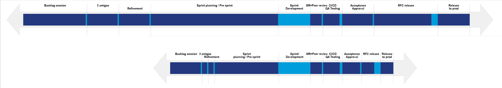

# Value Stream Heatmap Generator

Utility for generation of the heatmaps diagram.

## Install dependencies

```
python install -r requirements.txt
```


## .csv files conventions

Right now:

* column 1(second): process name/label. 
> if you want it to be rendered over two lines, use backslash n characters, for example: "Deployment\nto Prod").

* column 6: lead time

* column 9: process time


## Generate the html file and svg file:

Right now it is safe to be in a current folder where two files will be generated
```
cd example
./vsm-heatmap.py vsdata.csv
```

## Sample output: 


## How to generate future state heatmap with scale of the current state diagram


1. execute get-width action to obtain the width of the current diagram
```
$ vsm-heatmap.py get-width vsdata.csv

21000
```

2. Create a data file with optimised processes. Execute gen-heatmap action with svg width parameters of the current state heatmap diagram.
```
$ vsm-heatmap.py gen-heatmap vsdata-heatmap-future.csv 21000

Generated html: vsdata-future.html and diagram: tp-vsdata-future.svg with width: 10500 and svg width: 21000.
```

3. Render each .html file and use your favourite image editing software to cut/crop and layout the diagrams.



(c) ComputaCenter, 2023
